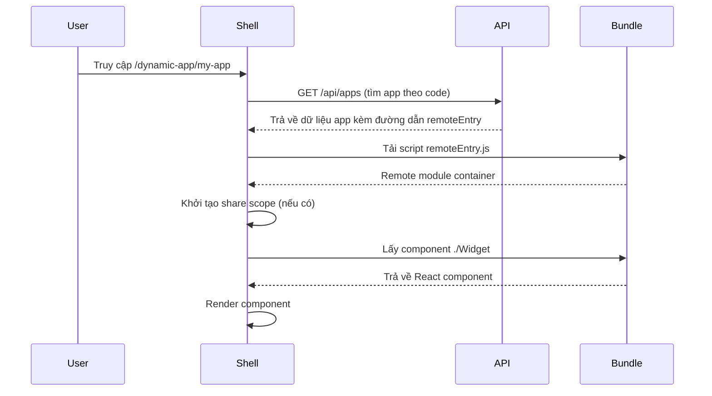

# Super Admin Portal - Kiến trúc Module Federation

## Tổng quan

Super Admin Portal đã được tái cấu trúc để tập trung hoàn toàn vào kiến trúc **Module Federation**, loại bỏ tích hợp qua iframe để đạt hiệu năng tốt hơn và trải nghiệm tích hợp mượt mà hơn.

## Mô hình quản lý ứng dụng

### Cấu trúc thực thể App

```typescript
interface App {
   id: number;
   name: string;          // Tên hiển thị (vd: "User Management")
   code: string;          // Định danh URL-safe (vd: "user-mgmt")
   icon?: string;         // URL icon (tuỳ chọn)
   remoteEntry?: string;  // Đường dẫn remote entry (Module Federation)
   origin?: string;       // Origin để kiểm tra CSP
   allowedScopes?: string[]; // Quyền (permissions) của ứng dụng
}
```

### Thay đổi chính so với kiến trúc cũ

1. **Di trú trường dữ liệu**: `url` → `code`
    - **Trước**: Dùng trường `url` có khoảng trắng/ký tự đặc biệt
    - **Sau**: Dùng trường `code` với định danh URL-safe (chỉ chữ số, chữ cái, dấu gạch ngang/"-")
    - **Lợi ích**: Loại bỏ lỗi mã hoá URL và đảm bảo định tuyến nhất quán

2. **Chiến lược định tuyến**: Theo tên → Theo code
    - **Trước**: `/dynamic-app/Tên Ứng Dụng` (gây vấn đề với khoảng trắng)
    - **Sau**: `/dynamic-app/ma-ung-dung` (gọn, URL-safe)

3. **Hướng tích hợp**: Hỗn hợp → Chỉ Module Federation
    - **Loại bỏ**: Tích hợp qua iframe (`/app/:appName`)
    - **Tập trung**: Chỉ Module Federation (`/dynamic-app/:appCode`)

## Quản lý bundle

### Thuật toán phát hiện remoteEntry.js

Hệ thống tự động tìm `remoteEntry.js` trong bundle được upload:

1. **Vị trí phổ biến**: Ưu tiên kiểm tra các đường dẫn chuẩn
    - `remoteEntry.js` (gốc)
    - `assets/remoteEntry.js`
    - `dist/remoteEntry.js`
    - `build/remoteEntry.js`

2. **Tìm kiếm đệ quy**: Nếu không tìm thấy ở vị trí phổ biến, sẽ quét toàn bộ cấu trúc bundle

3. **Lưu trữ đường dẫn**: Lưu đường dẫn tương đối vào trường `app.remoteEntry`
    - Ví dụ: `/bundles/my-app/assets/remoteEntry.js`

### Tạo ứng dụng một bước (One-Step App Creation)

Tạo app kèm bundle chỉ với một request:

```http
POST /api/apps/with-bundle
Content-Type: multipart/form-data

name: My Application
code: my-app
bundle: [bundle.zip file]
```

Cách này sẽ:
- Tạo bản ghi ứng dụng
- Xử lý bundle
- Tự động cập nhật trường `remoteEntry`
- Trả về đầy đủ thông tin app cùng bundle

## Tích hợp Module Federation

### Cấu hình Shell

Shell (`super-admin-shell`) được cấu hình để:
- Tải remote modules động lúc runtime
- Chia sẻ phụ thuộc React/React-DOM
- Tiêm/luân chuyển token xác thực
- Quản lý định tuyến và điều hướng

### Yêu cầu đối với Remote App

Remote app cần:
1. Export component `Widget` qua Module Federation
2. Đóng gói kèm `remoteEntry.js`
3. Nhận bối cảnh xác thực từ shell (token, scopes…)
4. (Tuỳ chọn) Tự xử lý định tuyến nội bộ

### Quy trình tải động



## Lợi ích của kiến trúc mới

1. **Định tuyến đơn giản**: Mã code URL-safe loại bỏ vấn đề encode
2. **Hiệu năng tốt hơn**: Module Federation vượt trội so với iframe
3. **Chia sẻ phụ thuộc**: Giảm kích thước bundle nhờ sharing
4. **Trải nghiệm tích hợp**: Không còn ranh giới iframe hay overhead postMessage
5. **An toàn kiểu**: TypeScript thuận lợi hơn cho remote components
6. **Trải nghiệm dev**: Debug, DX tốt hơn

## Di trú từ kiến trúc cũ

Với các triển khai cũ dựa trên iframe:

1. **Di trú dữ liệu**: Bổ sung trường `code` cho các app hiện có
2. **Đóng gói bundle**: Chuyển app hiện có thành remote Module Federation
3. **Upload bundle**: Sử dụng API upload mới
4. **Cập nhật routes**: Loại bỏ routes iframe, chuyển sang code-based routing

Hệ thống không còn hỗ trợ tích hợp qua iframe — tất cả app phải là Module Federation remotes.

## Lưu ý quan trọng (Best Practices)

- React/ReactDOM/jsx-runtime phải được chia sẻ dạng singleton:
   - Host (Shell) cần cung cấp `react`, `react-dom`, `react/jsx-runtime` qua cơ chế shared của Vite Federation (global `__federation_shared__` với scope `default`).
   - Remote khai báo `shared: ['react', 'react-dom', 'react/jsx-runtime']` để không bundle bản riêng.
   - Nếu không, sẽ phát sinh lỗi hooks như "Cannot read properties of null (reading 'useState')" do trùng React.

- remoteEntry của Vite là ES Module (có `import.meta`):
   - Khi chèn script phải dùng `<script type="module">`.
   - Trong host, ưu tiên tải ESM; nếu không thấy container trên `window[remoteName]`, fallback `import(remoteEntry)`.

- Khởi tạo share scope (Webpack) có điều kiện:
   - Chỉ gọi `container.init(__webpack_share_scopes__.default)` khi biến này tồn tại.
   - Với Vite host, thường không có share scope Webpack.

- Header bảo mật và CORS/CORP cho static bundles:
   - `Access-Control-Allow-Origin` phép origin của shell (vd: http://localhost:3000) + `Vary: Origin`.
   - `Cross-Origin-Resource-Policy: cross-origin` để cho phép tiêu thụ script từ origin khác.
   - CSP (`helmet`) cần whitelist `script-src`, `connect-src`, `frame-src` phù hợp; `frame-ancestors 'self'`.
   - Đặt middleware gắn header TRƯỚC `expressStatic('/bundles')` để file tĩnh trả đúng header.

- Cache-busting sau khi triển khai bundle mới:
   - Thêm query param (vd: `?v=timestamp`) khi load `remoteEntry.js` hoặc dùng tên file có hash.
   - Tránh dùng bản cache cũ gây lỗi không tương thích.

- Hợp đồng export của remote:
   - Expose `./Widget` và trả về React component. Một số build trả về `{ default: Component }`, một số trả về trực tiếp `Component` — host nên "unwrap" linh hoạt.

- Tương thích phiên bản:
   - Đảm bảo phiên bản React của host và remote tương thích; chênh lệch lớn có thể gây lỗi runtime.

- Chẩn đoán lỗi runtime:
   - Log URL `remoteEntry` đang tải; fallback dynamic import nếu cần.
   - Bắt lỗi `container.get`/`factory()` và hiển thị thông báo thân thiện.

- Bảo mật & nguồn cho phép:
   - Origin của remote nên được quản lý trong DB (bảng Apps) để sinh CSP động.
   - Không nới lỏng CSP quá mức (`unsafe-inline`) trừ khi thật sự cần cho style.

- Hiệu năng:
   - Chỉ share các thư viện thực sự cần thiết; giữ remote nhỏ gọn.
   - Có thể preload một số chunk nhẹ nếu cần cải thiện FCP.

- Dev/Local:
   - Giữ hostnames nhất quán (`localhost` vs `127.0.0.1`) để cookie/CSRF hoạt động đúng.
   - Log version React tại host/remote khi debug trùng React.