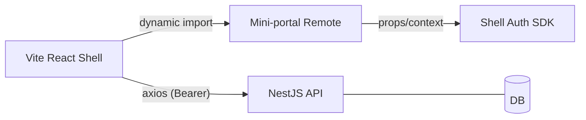
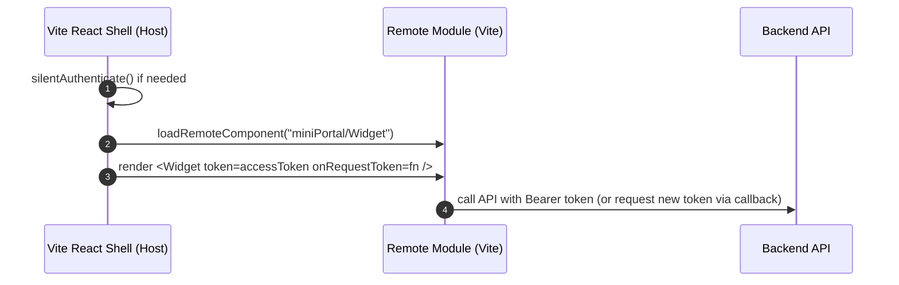

# Module Federation Variant (Microfrontend)

This document extends the Hybrid Contract to include a Module Federation (MF) option alongside Iframe embedding. Use MF when you need tighter UI integration and shared runtime, while keeping security boundaries in mind.

## Architecture

- Shell (Vite React in this repo) can act as MF host via `@originjs/vite-plugin-federation` (or another integration). A Next.js host is also possible but not used here.
- Mini-portal (Vite/React) is a remote exposing one or more components/pages.
- Auth still follows the same model: Shell manages identity (silent SSO, refresh cookie) and provides access tokens to remote modules via props or a shell SDK.



## Sequence (Loading a Remote Page)



## Contract

- Remote exposes components with a thin interface:
  - Props include `accessToken?`, `onRequestToken?()`, and optional `scopes?: string[]`.
  - Remote must not try to refresh tokens; only Shell refreshes. Remote can call `onRequestToken(scopes)` to ask Shell for a fresh scoped token.
- The same Topics from Hybrid Contract can be reused as internal events if needed (without postMessage).

## Shell (Vite) – Example Host Config (sketch)

Use `@originjs/vite-plugin-federation` to host remotes in Vite as well.

```ts
// super-admin-shell/vite.config.ts (sketch only)
import { defineConfig } from 'vite'
import react from '@vitejs/plugin-react'
import federation from '@originjs/vite-plugin-federation'

export default defineConfig({
  plugins: [
    react(),
    federation({
      name: 'super_admin_shell',
      remotes: {
        mini_portal_mf: 'http://localhost:5174/assets/remoteEntry.js'
      },
      shared: ['react', 'react-dom']
    })
  ]
})
```

## Mini-portal (Vite) – Example Config

Use `@originjs/vite-plugin-federation` to expose remote modules.

```ts
// vite.config.ts (sketch)
import { defineConfig } from 'vite'
import react from '@vitejs/plugin-react'
import federation from '@originjs/vite-plugin-federation'

export default defineConfig({
  plugins: [
    react(),
    federation({
      name: 'mini_portal_demo',
      filename: 'remoteEntry.js',
      exposes: {
        './Widget': './src/Widget.tsx',
      },
      shared: ['react', 'react-dom']
    })
  ],
  build: {
    target: 'esnext',
    cssCodeSplit: true,
  }
})
```

Example exposed component:
```tsx
// src/Widget.tsx
import React, { useEffect, useState } from 'react'

type Props = {
  accessToken?: string
  scopes?: string[]
  onRequestToken?: (scopes?: string[]) => Promise<string>
}

export default function Widget({ accessToken, scopes, onRequestToken }: Props) {
  const [token, setToken] = useState(accessToken)
  useEffect(() => {
    if (!token && onRequestToken) {
      onRequestToken(scopes).then(setToken).catch(console.error)
    }
  }, [token, onRequestToken, scopes])
  return <div>Mini Widget — token: {token ? 'received' : 'missing'}</div>
}
```

## Auth Integration Options

- Props-first (simple): Shell passes `accessToken` and refreshes via re-render or callback.
- SDK context (richer): Shell exposes a React context/provider that remote modules can consume for `getToken()`, `userProfile`, `bus.publish()`, etc.

## Security Considerations

- MF removes iframe process isolation; enforce strict shared deps, audits, and code provenance.
- Limit scopes per remote and validate on server side.
- Consider CSP and subresource integrity where applicable.

## When to choose which?

- Iframe: strong isolation, simpler security, looser integration; recommended default.
- MF: tighter UX and shared runtime; use for trusted teams/components.
