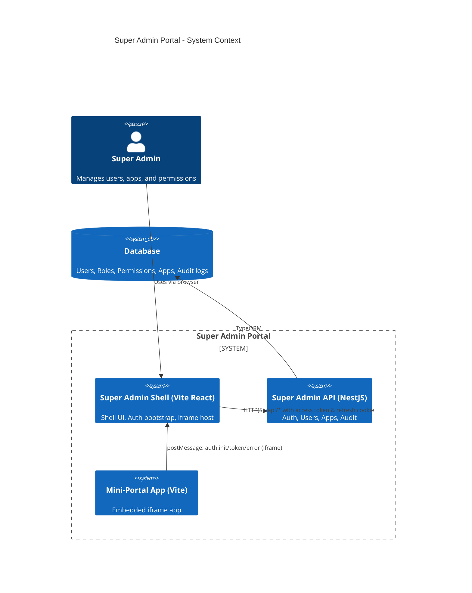
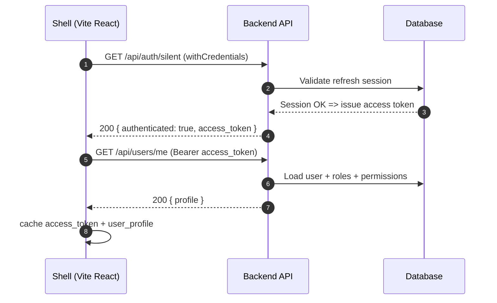
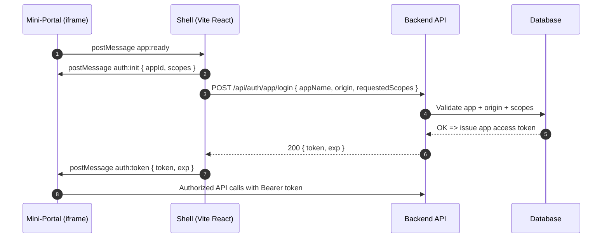
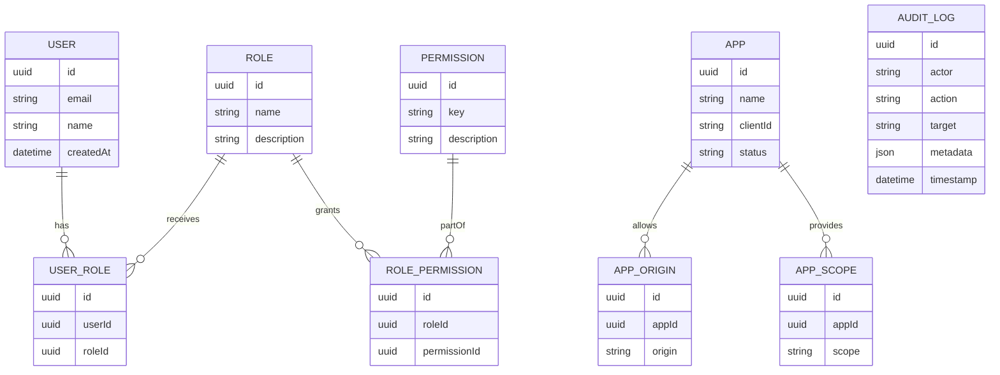
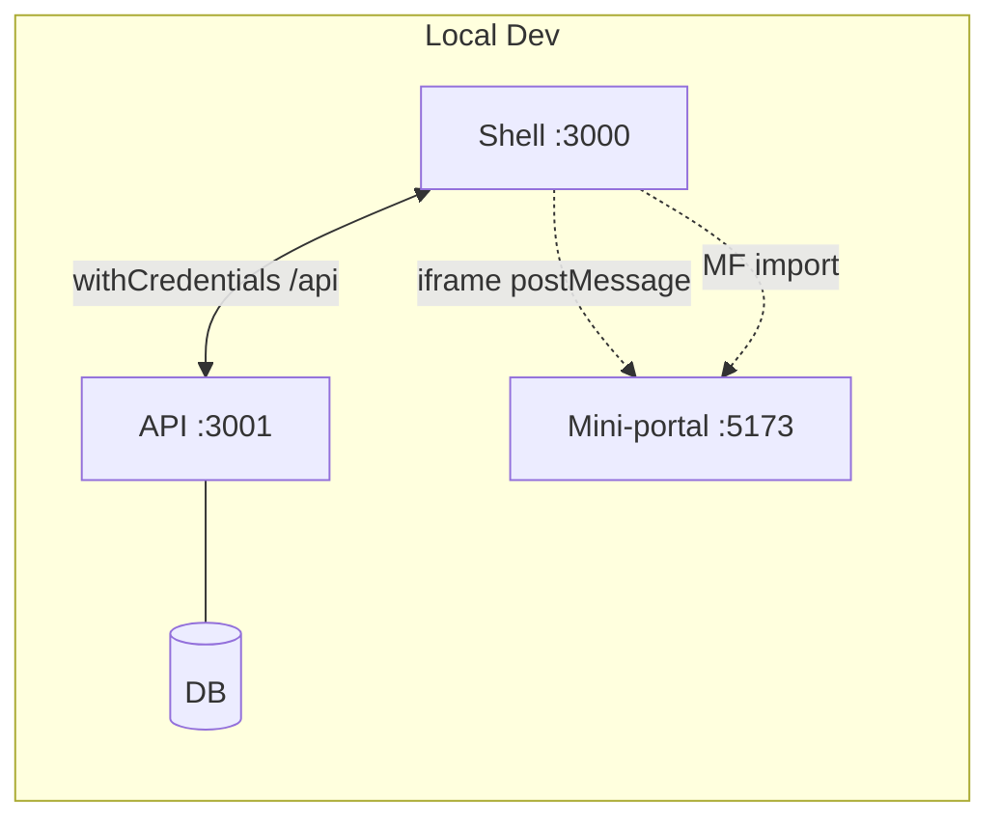

# Super Admin Portal — System Overview

This page provides an at-a-glance architecture map and core flows for the monorepo. For a Microfrontend alternative using Module Federation, see module-federation.md.

## 1) System Context

## 2) Silent SSO Sequence

## 3) Iframe Token Bridge Sequence

## 4) Data Model (ER Overview)

## 5) Deployment (Dev setup)

Notes
- Keep cookie and origins consistent (localhost vs 127.0.0.1) to avoid refresh cookie issues.
- Update scopes in both the Shell bridge and server validation when extending permissions.
