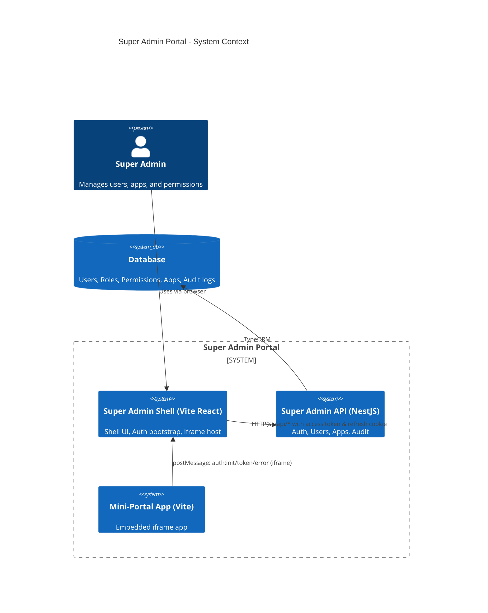
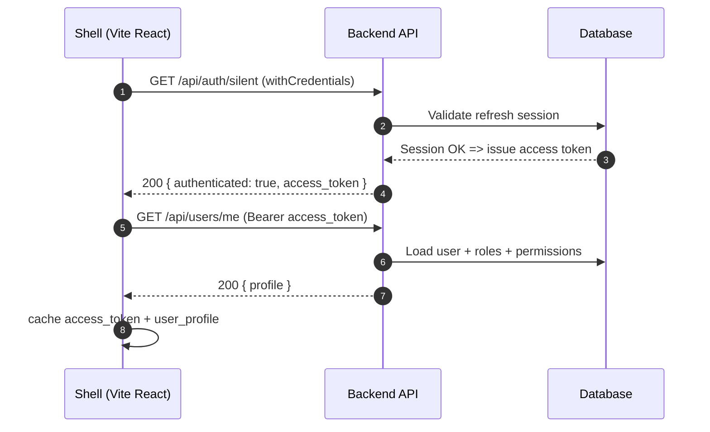
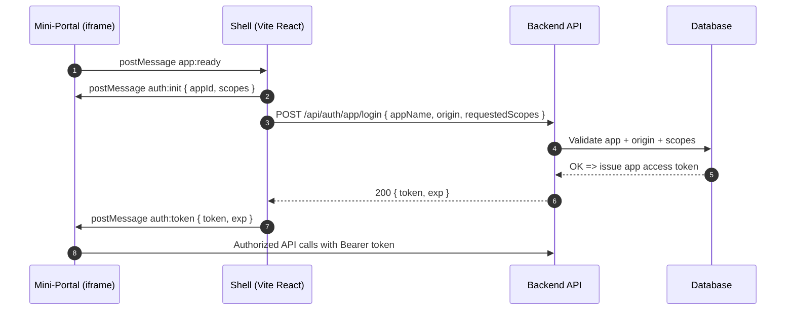
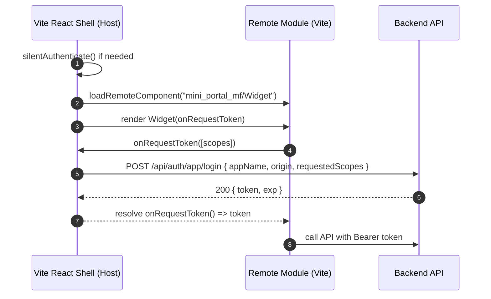
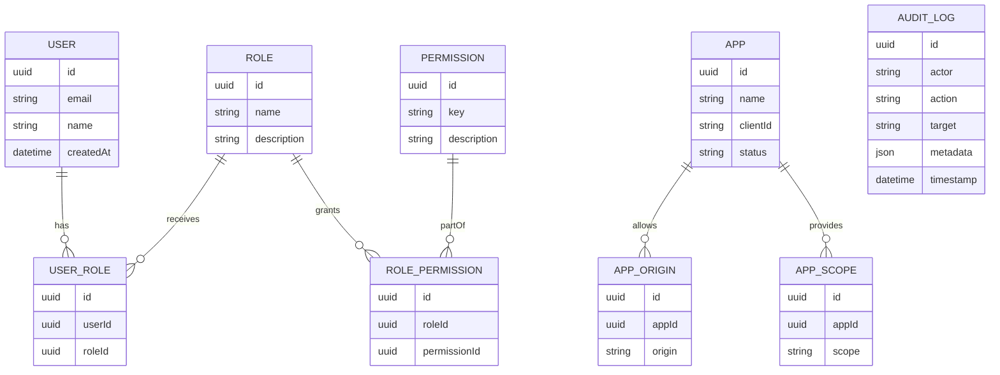

# Super Admin Portal — System Overview

This page provides an at-a-glance architecture map and core flows for the monorepo. For a Microfrontend alternative using Module Federation, see module-federation.md.

## 1) System Context



## 2) Silent SSO Sequence



## 3) Iframe Token Bridge Sequence



## 3b) Module Federation (MF) Architecture & Sequence

MF is an alternative to iframe embedding for trusted remotes, enabling tighter UX and shared runtime while the Shell remains the system of record for auth and token issuance.

```mermaid
graph LR
  Shell[Super Admin Shell (Host)] -->|dynamic import| Remote[mini-portal-mf (Remote)]
  Shell -->|axios Bearer| API[NestJS API]
  Remote -->|props/context| AuthSDK[Shell Auth SDK]
  API --- DB[(DB)]
```

### MF Sequence (Loading a Remote and Token Flow)



## 4) Data Model (ER Overview)



## 5) Deployment (Dev setup)

```mermaid
graph LR
  subgraph Local_Dev
    FE[Shell :3000]
    API[API :3001]
    MINI[Mini-portal (iframe) :5173]
    MF[Mini-portal MF :5174]
    DB[(DB)]
  end
  FE -->|withCredentials /api| API
  API --- DB
  FE -.->|iframe postMessage| MINI
  %% Optional MF path
  FE -.->|MF dynamic import| MF
```

Notes
- Keep cookie and origins consistent (localhost vs 127.0.0.1) to avoid refresh cookie issues.
- Update scopes in both the Shell bridge and server validation when extending permissions.
- MF remotes receive tokens via props/callback (e.g., onRequestToken); only the Shell refreshes tokens.
- Enforce server-side validation for app origins and requested scopes for both iframe and MF flows.
